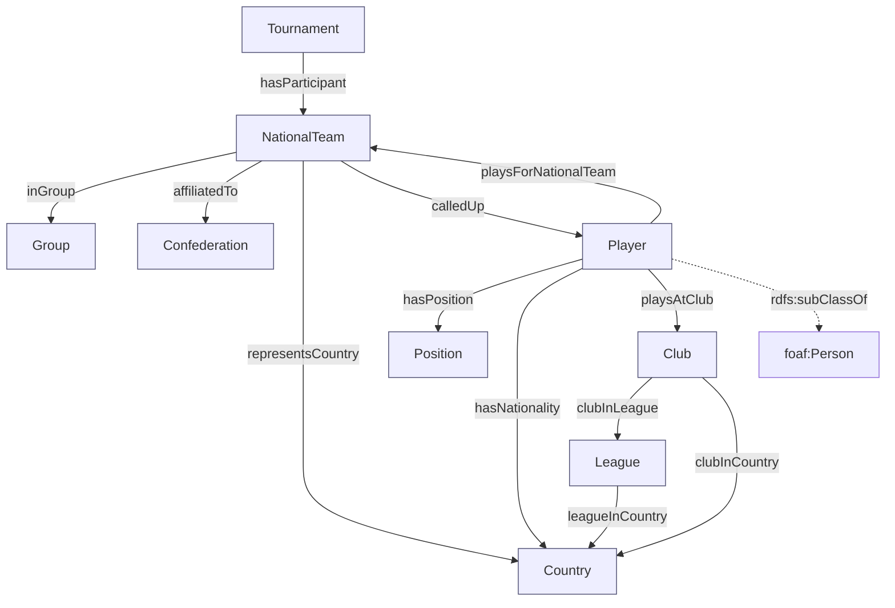

# WC2026-KG — a knowledge graph of the 2026 FIFA World Cup squads

A SPARQL-queryable RDF/Turtle knowledge graph of all **48 squads** (≈**1248
players**) at the 2026 FIFA World Cup, built from Wikipedia with a custom but
standards-aligned OWL ontology.

The pipeline scrapes the article _"2026 FIFA World Cup squads"_ via the MediaWiki
API, enriches club→league/country links from Wikidata, and emits three Turtle
files: the ontology (TBox), the data (ABox), and a combined graph.

```
ontology.ttl   the ontology / TBox      (~134 triples)
data.ttl       the instance data / ABox (~18.1k triples)
wc2026.ttl     ontology + data combined (~18.3k triples)
```

## How to run

```bash
cd wc2026-kg
python3 -m venv .venv && source .venv/bin/activate
pip install -r requirements.txt
python build.py
```

`build.py` runs the whole pipeline: acquire → parse → enrich → emit → validate →
demo queries. The first run hits the network (Wikipedia + Wikidata) and writes
raw responses to `./cache/`. **Every subsequent run is fully offline and produces
byte-identical output** (the build is idempotent). Delete `./cache/` to refresh
from the live sources.

No API keys are required.

### Market-value enrichment

There are two enrichment sources, merged at build time (live data overrides the
static snapshot for overlapping fields):

1. **Scraped snapshot — `market_values.json` (default, offline).** Real market
   values (EUR) scraped from Transfermarkt's World Cup page, iterated **per nation**
   (the `land_id` filter, so every squad member is captured) and matched onto the
   squads by name slug (with an order-independent fallback for romanised names like
   "Son Heung-min"). As of the 2026-06-14 scrape this covers **1136 of 1248
   players** — all 48 teams have values; the rest are name-form mismatches
   (e.g. Brazilian mononyms). The file is keyed by the canonical player id
   (`slug(name)-yearOfBirth`) so it maps straight onto the graph's player nodes,
   and is loaded automatically; no Docker required. Regenerate it (polite: cached
   pages, descriptive UA, rate-limited) with:

   ```bash
   python scrape_transfermarkt.py   # scrapes TM, writes market_values.json
   python build.py                  # rebuild the graph with the new values
   ```

2. **Live Transfermarkt API (optional).** Adds market value _and_ height _and_
   preferred foot. Transfermarkt is Cloudflare-protected, so this prefers a
   locally hosted
   [felipeall/transfermarkt-api](https://github.com/felipeall/transfermarkt-api):

   ```bash
   docker run -p 8010:8000 felipeall/transfermarkt-api:latest
   export TRANSFERMARKT_API_URL=http://localhost:8010   # default
   python build.py
   ```

Enrichment is **entirely best-effort**: if a source is unreachable, or any single
lookup fails, that data is silently skipped and the build still succeeds. Demo
query #4 runs whenever any market-value triples exist (i.e. by default, from the
static snapshot). Set `ENABLE_TRANSFERMARKT=0` to disable the live API path; delete
`market_values.json` to drop the static one.

## The ontology

Namespaces:

| prefix                                              | IRI                                                      |
| --------------------------------------------------- | -------------------------------------------------------- |
| `wc:`                                               | `http://example.org/wc2026/ontology#` (terms / TBox)     |
| `player:` `team:` `club:` `league:` `country:` `group:` `confederation:` `position:` `tournament:` | `http://example.org/wc2026/resource/<type>/` (instances / ABox) |
| plus `rdf:` `rdfs:` `owl:` `xsd:` `foaf:` `schema:` |

Instances live under `…/resource/<type>/<slug>`. Turtle prefixed names can't
contain a `/` in their local part, so a single `wcr:` prefix could never
abbreviate them — instead one prefix per resource type is bound (in
`ontology.py:bind`), so `…/resource/player/erling-haaland-2000` serialises as
the readable `player:erling-haaland-2000`. The IRIs themselves are unchanged.

**Classes:** `wc:Tournament`, `wc:NationalTeam`, `wc:Player`
(`rdfs:subClassOf foaf:Person`), `wc:Club`, `wc:League`, `wc:Group`,
`wc:Confederation`, `wc:Country`, `wc:Position`.

**Object properties** (with `rdfs:domain`/`rdfs:range`, and `owl:inverseOf` where
natural):

| property                                  | domain → range                  |
| ----------------------------------------- | ------------------------------- |
| `wc:hasParticipant`                       | Tournament → NationalTeam       |
| `wc:inGroup`                              | NationalTeam → Group            |
| `wc:affiliatedTo`                         | NationalTeam → Confederation    |
| `wc:representsCountry`                    | NationalTeam → Country          |
| `wc:calledUp` ⇄ `wc:playsForNationalTeam` | NationalTeam → Player (inverse) |
| `wc:playsAtClub`                          | Player → Club                   |
| `wc:hasPosition`                          | Player → Position               |
| `wc:hasNationality`                       | Player → Country                |
| `wc:clubInLeague`                         | Club → League                   |
| `wc:clubInCountry`                        | Club → Country                  |
| `wc:leagueInCountry`                      | League → Country                |

**Datatype properties:**

- Player: `wc:shirtNumber` (xsd:integer), `wc:dateOfBirth` (xsd:date),
  `wc:caps` (xsd:integer), `wc:goalsForCountry` (xsd:integer),
  `wc:marketValueEUR` (xsd:decimal, optional), `wc:heightCm` (xsd:integer,
  optional), `wc:preferredFoot` (xsd:string, optional); plus `foaf:name` +
  `rdfs:label` for the name.
- NationalTeam: `rdfs:label`, `wc:fifaCode` (xsd:string), `wc:squadSize`
  (xsd:integer), `wc:totalMarketValueEUR` (xsd:decimal, optional).
- Group: `rdfs:label` ("Group A" …).

**Position** is a controlled vocabulary of four instances:
`position:{GK|DF|MF|FW}`.

## URI scheme

Deterministic, idempotent and UTF-8 safe. Slugification (lowercase, diacritics
stripped, hyphenated) is applied **only to the URI local part** — the full name
**with** diacritics (ø, å, ü, é, …) is always preserved in the `foaf:name`
literal.

| entity        | URI pattern                            | example                        |
| ------------- | -------------------------------------- | ------------------------------ |
| player        | `player:{slug(name)}-{yearOfBirth}`    | `player:erling-haaland-2000`   |
| team          | `team:{slug(country)}`                 | `team:norway`                  |
| club          | `club:{slug(name)}`                    | `club:manchester-city`         |
| league        | `league:{slug(name)}`                  | `league:premier-league`        |
| country       | `country:{code}`                       | `country:nor`                  |
| group         | `group:{letter}`                       | `group:I`                      |
| confederation | `confederation:{conf}`                 | `confederation:UEFA`           |
| position      | `position:{code}`                      | `position:FW`                  |

The country `{code}` is the 3-letter FIFA code for the 48 participating nations
(a stable, unique key; FIFA codes are used where they differ from ISO-3166
alpha-3, e.g. GER, NED, SUI, RSA, POR, CRO) and a name slug for any other
country that only appears as a club's location (the "iso3 or slug" rule).

Shared clubs, leagues and countries are de-duplicated, so every distinct entity
is exactly one node (e.g. all Premier League clubs point at the single
`league:premier-league`).

## Data provenance & caveats

- **Squads:** Wikipedia, _"2026 FIFA World Cup squads"_, via the MediaWiki
  `action=parse` API. Final 26-man squads were locked **1 June 2026**; the graph
  reflects the article as published. Shirt number, position, name, date of birth,
  caps, goals and club come straight from the per-nation squad tables.
- **Group letter** is read from the article's section structure (Group A–L). The
  parser verifies the invariants 48 teams / 12 groups / ≤26 players per squad
  and aborts if they don't hold.
- **Confederation and FIFA code** are not reliable in the squad tables, so they
  come from a small hardcoded lookup (`lookups.py`) — the documented fallback.
- **Club country** is derived from the flag in each club cell (the club's
  national-association flag filename).
- **Club → league / league country** come from **Wikidata** (`P118` league,
  `P17` country), which resolves leagues that Wikipedia infoboxes hide behind
  `{{… football updater}}` templates (Premier League, La Liga, …). Wikipedia
  infobox wikitext is used as a fallback. ~421 of 452 clubs get a league; the
  rest (lower-league / national-team-only entries) are simply left without one.
- **Market value** is an _optional_ enrichment, scraped per nation from
  Transfermarkt's World Cup page (see above) into `market_values.json` — real
  values for 1136/1248 players as of 2026-06-14 (all 48 teams covered; the rest
  are name-form mismatches). A live Transfermarkt API, if configured, supersedes
  it and additionally supplies **height** and **preferred foot**.
- All raw HTTP responses are cached under `./cache/` with a descriptive
  User-Agent and rate limiting, so reruns are offline and polite.
- Parsing primary path is the MediaWiki API + BeautifulSoup; `pandas.read_html`
  is the documented fallback for the squad tables.



## Validation & demo queries

`build.py` re-loads `wc2026.ttl` with rdflib (asserting it parses), prints the
triple count and per-class instance counts, then runs four SPARQL queries.
Representative output:

```
Player 1248 · Club 452 · League 92 · Country 84 · NationalTeam 48
Group 12 · Confederation 6 · Position 4 · Tournament 1   (≈18,374 triples)
```

**1. Player count per group** → 104 per group (26 × 4), all twelve groups.

**2. Top 10 clubs by players sent**

```
19  Manchester City        12  Atlético Madrid
17  Bayern Munich          12  Crystal Palace
16  Paris Saint-Germain    12  Manchester United
15  Arsenal                11  Borussia Dortmund
14  Barcelona
12  Al-Hilal
```

**3. All forwards (FW) for Brazil, with shirt number and club**

```
#7  Vinícius Júnior  Real Madrid     #21 Luiz Henrique      Zenit Saint Petersburg
#9  Matheus Cunha    Man United      #22 Gabriel Martinelli Arsenal
#10 Neymar           Santos          #25 Igor Thiago        Brentford
#11 Raphinha         Barcelona       #26 Rayan              Bournemouth
#19 Endrick          Lyon
```

**4. Most valuable player per team** — runs by default off the scraped
`market_values.json` (top of the list):

```
Norway    Erling Haaland   €200,000,000    Brazil    Vinícius Júnior  €140,000,000
Spain     Lamine Yamal     €200,000,000    Portugal  João Neves       €140,000,000
France    Kylian Mbappé    €180,000,000    England   Jude Bellingham  €130,000,000
```

The four queries, copy-pasteable:

```sparql
# 1. Player count per group
PREFIX wc: <http://example.org/wc2026/ontology#>
PREFIX rdfs: <http://www.w3.org/2000/01/rdf-schema#>
SELECT ?group (COUNT(?player) AS ?players) WHERE {
  ?team wc:inGroup ?g ; wc:calledUp ?player .
  ?g rdfs:label ?group .
} GROUP BY ?group ORDER BY ?group

# 2. Top 10 clubs by players sent
PREFIX wc: <http://example.org/wc2026/ontology#>
PREFIX rdfs: <http://www.w3.org/2000/01/rdf-schema#>
SELECT ?club (COUNT(?player) AS ?n) WHERE {
  ?player wc:playsAtClub ?c . ?c rdfs:label ?club .
} GROUP BY ?club ORDER BY DESC(?n) ?club LIMIT 10

# 3. All forwards for a nation (Brazil) with shirt number and club
PREFIX wc: <http://example.org/wc2026/ontology#>
PREFIX rdfs: <http://www.w3.org/2000/01/rdf-schema#>
PREFIX foaf: <http://xmlns.com/foaf/0.1/>
SELECT ?shirt ?name ?club WHERE {
  ?team rdfs:label "Brazil"@en ; wc:calledUp ?p .
  ?p wc:hasPosition <http://example.org/wc2026/resource/position/FW> ;
     foaf:name ?name .
  OPTIONAL { ?p wc:shirtNumber ?shirt }
  OPTIONAL { ?p wc:playsAtClub ?cl . ?cl rdfs:label ?club }
} ORDER BY ?shirt

# 4. Most valuable player per team (needs enrichment)
PREFIX wc: <http://example.org/wc2026/ontology#>
PREFIX rdfs: <http://www.w3.org/2000/01/rdf-schema#>
PREFIX foaf: <http://xmlns.com/foaf/0.1/>
SELECT ?team ?name ?value WHERE {
  { SELECT ?t (MAX(?v) AS ?value) WHERE {
      ?t wc:calledUp ?pp . ?pp wc:marketValueEUR ?v .
    } GROUP BY ?t }
  ?t rdfs:label ?team ; wc:calledUp ?p .
  ?p wc:marketValueEUR ?value ; foaf:name ?name .
} ORDER BY DESC(?value)
```

## One fully-modeled player

```turtle
@prefix wc:     <http://example.org/wc2026/ontology#> .
@prefix player: <http://example.org/wc2026/resource/player/> .
@prefix team:   <http://example.org/wc2026/resource/team/> .
@prefix club:   <http://example.org/wc2026/resource/club/> .
@prefix league: <http://example.org/wc2026/resource/league/> .
@prefix country:    <http://example.org/wc2026/resource/country/> .
@prefix group:      <http://example.org/wc2026/resource/group/> .
@prefix confederation: <http://example.org/wc2026/resource/confederation/> .
@prefix position:   <http://example.org/wc2026/resource/position/> .
@prefix rdfs: <http://www.w3.org/2000/01/rdf-schema#> .
@prefix foaf: <http://xmlns.com/foaf/0.1/> .
@prefix xsd:  <http://www.w3.org/2001/XMLSchema#> .

player:erling-haaland-2000 a wc:Player ;
    rdfs:label "Erling Haaland"@en ;
    foaf:name "Erling Haaland" ;
    wc:shirtNumber 9 ;
    wc:dateOfBirth "2000-07-21"^^xsd:date ;
    wc:caps 50 ;
    wc:goalsForCountry 55 ;
    wc:hasPosition position:FW ;
    wc:hasNationality country:nor ;
    wc:playsAtClub club:manchester-city ;
    wc:playsForNationalTeam team:norway .

team:norway a wc:NationalTeam ;
    rdfs:label "Norway"@en ;
    wc:fifaCode "NOR" ;
    wc:squadSize 26 ;
    wc:inGroup group:I ;
    wc:affiliatedTo confederation:UEFA ;
    wc:representsCountry country:nor ;
    wc:calledUp player:erling-haaland-2000 .

club:manchester-city a wc:Club ;
    rdfs:label "Manchester City"@en ;
    wc:clubInCountry country:eng ;     # England is a WC nation → FIFA code
    wc:clubInLeague league:premier-league .
```

## Project layout

```
build.py        orchestrator: run the whole pipeline
acquire.py      MediaWiki + Wikidata acquisition, caching, HTML parsing
lookups.py      48-nation fallback: FIFA codes, confederations, positions
ontology.py     the TBox (OWL ontology) builder
graph.py        the ABox builder (data → RDF, de-duplicated)
enrich.py       enrichment: scraped market_values.json + optional Transfermarkt
scrape_transfermarkt.py  scrape real market values from Transfermarkt
market_values.json       scraped market values, keyed by player id (committed)
uris.py         deterministic URI construction
cache/          raw cached HTTP responses (gitignored)
```
